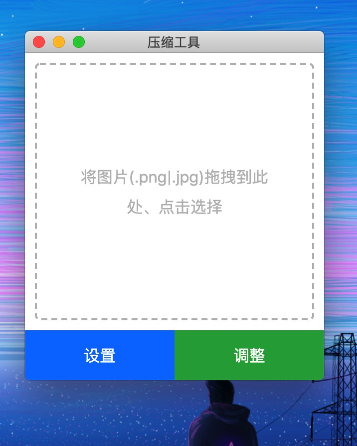
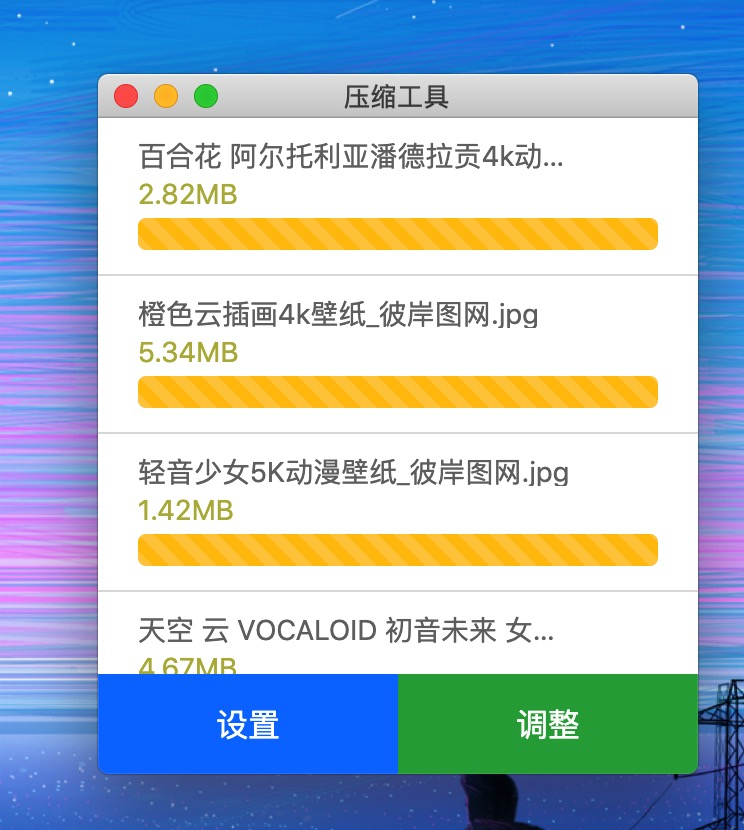
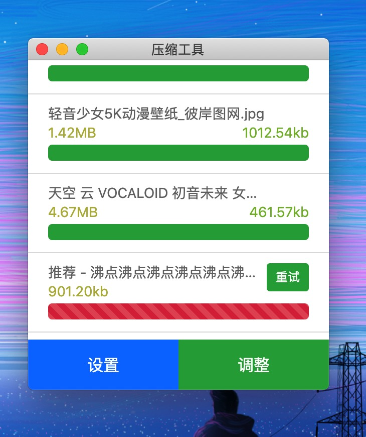

### electron 图片压缩工具

<p>
    
    
    
</p>

#### 实现简单的压缩图片功能（png、jpg、jpeg）

- 1 通过调整图片质量压缩图片
- 2 可以调整图片实际宽度和高度

#### `Electron` 相关知识

- 主进程
- 渲染进程
- 主进程与渲染进程间通信 `ipcMain` 与 `ipcRenderer`
- 不同窗口间的通信
- 通知
- 拖拽
- 菜单设置
- `electron.app` 上的一些方法
    - `remote.app.getPath('desktop')`, 获取路径 [详见](https://electronjs.org/docs/api/app#appgetpathname)

#### 压缩图片使用的工具 `sharp`

```
npm i sharp
```

#### 本地开发项目运行

```
npm start
```

#### 开发环境搭建 [环境搭建参考项目](https://github.com/electron-react-boilerplate/electron-react-boilerplate)

- `npm run start-renderer-dev` 启动渲染进程
- `npm run start-main-dev` 启动主进程
- `webpack` 配置主要需要注意构建目标 `target` 配置，对于主进程使用`electron-main`,渲染进程`electron-renderer` 
[详见](https://www.webpackjs.com/configuration/target/#target)


#### `Electron` 打包相关

- `electron-builder` 详细配置参考： [详细](https://www.npmjs.com/package/electron-builder)，
[文档](https://www.electron.build/)

```
npm i electron-builder -D
```

- 打包优化 [详细](https://imweb.io/topic/5b6817b5f6734fdf12b4b09c)

```
主要思路：(js、css、html....)等资源，先用`webpack`打包，
再将打包好的静态资源，使用`electron-builder`打包进安装包里面
```

- 分析安装包内容

    - `app.asar`
    
    ```
    # 安装 asar
    npm install -g asar
    
    # 解压到 ./app 文件夹下
    asar extarct app.asar ./app
    ```

#### 打包发布配置，自动发布release [详情](https://www.electron.build/configuration/publish)

- 使用 github release 进行发布
- 将项目关联到 github
- `package.json配置`

```
{
  "build":
    "publish": ["github"]
  }
}
```

- 生成 GitHub personal access token [add token](https://github.com/settings/tokens/new),
生产token后添加如下配置，将`GH_TOKEN`添加到环境变量中，当`npm run release`运行的时候，`electron-builder`会自动
帮我们上传到 github release

```
"release": "cross-env GH_TOKEN=e9780fa2016917b730babef1371b3593a58a99b5 electron-builder",
```
- 注意：token不要放在代码里一起上传到github，这是不安全的，上传之后会造成`release`发布失败

#### 应用打包，生产安装包

- `npm run pack` 本地开发，用来分析包内容时使用
- `npm run release` 打包发布，生成一个`release`版本
