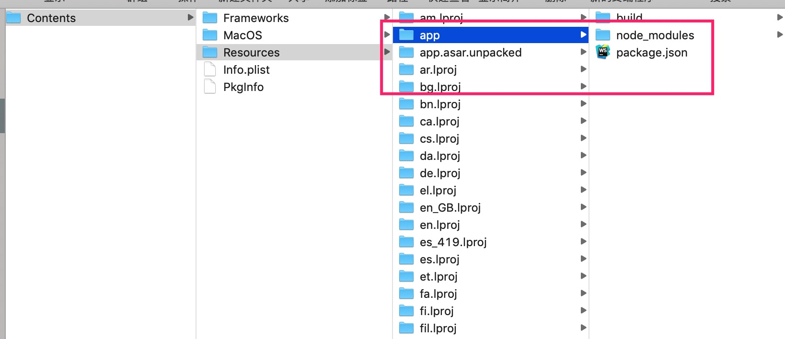

### electron 图片压缩工具
- mac   

<p>
    
    
    
</p>

- win   

<p>
    
    
    
</p>

#### 下载

- `Mac` 
- `windows`
- `linux`
- [download](https://github.com/aikeProject/moke-electron-compress/releases)

#### 实现简单的压缩图片功能（png、jpg、jpeg）

- 可以通过调整图片质量压缩图片
- 可以调整图片实际宽度和高度

#### `Electron` 相关知识

- 主进程 
  - [main-and-renderer-processes](https://electronjs.org/docs/tutorial/application-architecture#main-and-renderer-processes)

  ```
  1、一个 Electron 应用总是有且只有一个主进程
  2、在 Node.js 的 API 支持下可以在页面中和操作系统进行一些底层交互
  ```

- 渲染进程

  ```
  在主进程中使用"BrowserWindow"就可以创建页面，每个"BrowserWindow"运行在自己的渲染进程里面
  ```

####  Electron API 的核心特

- [API相关参考](https://github.com/demopark/electron-api-demos-Zh_CN)
- 主进程与渲染进程间通信 `ipcMain` 与 `ipcRenderer` 
- 不同窗口间的通信
- 通知
- 拖拽
- 菜单设置
- `electron.app` 上的一些方法
    - `remote.app.getPath('desktop')`, 获取路径 
    - [详见](https://electronjs.org/docs/api/app#appgetpathname)

#### 压缩图片使用的工具 `sharp` [sharp](https://github.com/lovell/sharp)

- `sharp`在`electron`中使用，需要重新编译
- 第一种方法：[electron-rebuild](https://electronjs.org/docs/tutorial/using-native-node-modules#%E4%B8%BA-electron-%E5%AE%89%E8%A3%85%E5%B9%B6%E9%87%8D%E6%96%B0%E7%BC%96%E8%AF%91%E6%A8%A1%E5%9D%97)

  ```
  package.json 配置
  "scripts": {
      "postinstall": "npx electron-rebuild"
  }

  在npm install之后，执行electron-rebuild进行重新编译即可，electron-rebuild只会重新编译，dependencies中的包
  ```

- 第二种方法：

  - [node-gyp手动编译](https://electronjs.org/docs/tutorial/using-native-node-modules#%E4%B8%BA-electron-%E5%AE%89%E8%A3%85%E5%B9%B6%E9%87%8D%E6%96%B0%E7%BC%96%E8%AF%91%E6%A8%A1%E5%9D%97)参考
  - [preinstall.sh](preinstall.sh) 手动编译脚本，在`npm install`之前就下载编译好sharp

#### 开发环境搭建 [参考项目](https://github.com/electron-react-boilerplate/electron-react-boilerplate)

- `npm run start-renderer-dev` 启动渲染进程
- `npm run start-main-dev` 启动主进程
- `webpack` 配置主要需要注意构建目标 `target` 配置，对于主进程使用`electron-main`,渲染进程`electron-renderer`。
[详见](https://www.webpackjs.com/configuration/target/#target)

#### 本地开发项目运行

- `npm start`

  ```
  "start": "concurrently \"wait-on http://localhost:3000/ && npm run start-main-dev\" \"npm run start-renderer-dev\""

  先启动webpack3000端口的本地服务，再启动"electron"
  "wait-on" 的作用：等待"http://localhost:3000/"就绪，之后再启动"electron"
  ```

- `npm run pack` 用于分析
- `npm run dist` 打包成安装包
- `npm run release` 打包并发布

##### 本地开发时的一些问题

- `electron`换源安装
    - [electron换源](https://blog.tomyail.com/install-electron-slow-in-china/)
    - electron安装脚本 [preinstall.sh](preinstall.sh)

  ```
  # 在国内打包的会后会下载
  "https://github.com/electron/electron/releases/download/v7.1.2/electron-v7.1.2-darwin-x64.zip",
  # 这样的文件，特别慢，就算我翻了墙也慢

  # 解决办法，使用国内镜像源安装
  ```

  <p>
    
    
  </p>

- `sharp`换源安装

  <p>
    
    
  </p>

- `electron-builder`换源安装打包所需要的资源
  - [详见](https://www.electron.build/configuration/configuration.html)

  ```
  // 设置electron-builder下载electron的源
  "build": {
      "electronDownload": {
        "mirror": "https://npm.taobao.org/mirrors/electron/"
      },
  }
  ```

  - 有一些打包时需要的依赖包，是换不了源的，只能等待他正常安装
  - 比如：[windows 下载 winCodeSign](https://www.cnblogs.com/chenweixuan/p/7693718.html) 这个文件不大，稍微等会也能下完
  
  <p>
    
    
  </p>

#### `Electron` 打包相关

- `electron-builder` 详细配置参考：
  - [详细](https://www.npmjs.com/package/electron-builder)  
  - [文档](https://www.electron.build/) 

- 安装`electron-builder`

  ```
  npm i electron-builder -D
  ```

- 配置介绍

  ```
  "build": {
      "appId": "mokeCompress", // 应用的id
      "productName": "Moke-Compress", // 应用的名称
      "copyright": "Copyright © 2019 ${author}", // 版权信息
      // 需要打包的文件
      "files": [
        "build/**/*",
        "node_modules/**/*",
        "package.json"
      ],
      "directories": {
        // 应用图标、任务栏图标等资源的地址
        "buildResources": "assets"
      },
      "extraMetadata": {
        // webpack打包之后的主进程入口文件
        "main": "./build/main.js"
      },
      // 用于发布的相关配置
      "publish": [
        "github"
      ],
      "extends": null,
      // Mac安装包相关配置
      "mac": {
        // 应用的分类
        "category": "public.app-category.productivity",
        // 安装包名
        "artifactName": "${productName}-${version}-${arch}.${ext}"
      },
      // mac .dmg格式安装包，配置
      "dmg": {
        "background": "assets/appdmg.png",
        "icon": "assets/icon.icns",
        "iconSize": 100,
        "contents": [
          {
            "x": 380,
            "y": 280,
            "type": "link",
            "path": "/Applications"
          },
          {
            "x": 110,
            "y": 280,
            "type": "file"
          }
        ],
        "window": {
          "width": 500,
          "height": 500
        }
      },
      // windows 配置
      "win": {
        "target": [
          "msi",
          "nsis"
        ],
        "icon": "assets/icon.ico",
        "artifactName": "${productName}-Web-Setup-${version}.${ext}",
        "publisherName": "成雨"
      },
      "nsis": {
        "allowToChangeInstallationDirectory": true,
        "oneClick": false,
        "perMachine": false
      },
      // linux配置
      "linux": {
        "target": [
          "deb", // deb 是 ubuntu 、debian 的格式
          "rpm"  // rpm 是 redhat 、fedora 、suse 的格式
        ],
        // 安装包名
        "artifactName": "${productName}-Web-Setup-${version}.${ext}"
      }
  }
  ```

- 打包优化    
  - [详细 打包优化-1](https://imweb.io/topic/5b6817b5f6734fdf12b4b09c)   
  - [详细 打包优化-2](https://imweb.io/topic/5b9f500cc2ec8e6772f34d79)

  ```
  主要思路：(js、css、html....)等资源，先用`webpack`打包，
  再将打包好的静态资源，使用`electron-builder`打包进安装包里面
  ```

- 分析安装包内容

    - `app.asar`
    
    ```
    # 安装 asar
    npm install -g asar
    
    # 解压到 ./app 文件夹下
    asar e app.asar ./app
    ```

  <p>
  
  
  </p>

#### 打包发布配置，自动发布release

- [详见](https://www.electron.build/configuration/publish)
- [github releases文档](https://help.github.com/cn/github/administering-a-repository/creating-releases)
- [github releases api 文档](https://developer.github.com/v3/repos/releases/#create-a-release)

- `package.json配置`

  ```
  {
    "build":
      "publish": ["github"]
    }
  }
  ```

- 生成 GitHub personal access token
  [add token](https://github.com/settings/tokens/new),
  生成token后添加如下配置，将`GH_TOKEN`添加到环境变量中，当`npm run
  release`运行的时候，`electron-builder`会自动 帮我们上传到 github release

  ```
  "release": "cross-env GH_TOKEN=e9780fa2016917b730babef1371b3593a58a99b5 electron-builder",
  ```

- 注意：token不要放在代码里一起上传到github，这是不安全的，上传之后会造成`release`发布失败

#### 应用打包，生成安装包

- `npm run pack` 本地开发时，用来分析包内容时使用
- `npm run release` 打包发布，生成一个`release`版本

#### `github actions` 持续集成

- [github actions](https://help.github.com/cn/actions/automating-your-workflow-with-github-actions/getting-started-with-github-actions)
- [创建 JavaScript 操作](https://help.github.com/cn/actions/automating-your-workflow-with-github-actions/creating-a-javascript-action)
- [create-release](https://github.com/actions/create-release)
- [upload-release-asset](https://github.com/actions/upload-release-asset)

- 设置环境变量`GH_TOKEN`

  <p>
  
  </p>

- 该项目完整配置

  ```yaml
  name: Create Release

  on:
    push:
      branches:
        - master

  jobs:
    build:
      name: node版本 ${{ matrix.node_version }} 操作系统 ${{ matrix.os }}
      runs-on: ${{ matrix.os }}

      # 环境运行矩阵，会同时在mac、windows、ubuntu下运行
      strategy:
        matrix:
          node-version: [10.x]
          os: [macOS-latest, windows-latest, ubuntu-latest]

      steps:
      - uses: actions/checkout@v1
      - name: Use Node.js ${{ matrix.node-version }}
        uses: actions/setup-node@v1
        with:
          node-version: ${{ matrix.node-version }}
      - name: npm install, build
        # release 发布上传功能，由electron-builder提供 （npm run release）
        run: |
          npm ci
          npm run release
        # 环境变量
        env:
          CI: true
          GH_TOKEN: ${{ secrets.GH_TOKEN }}
          NO_LOCAL: true
  ```

#### 知识点

- 拖放(Drag 与 drop)
  - [详见](https://www.cnblogs.com/sqh17/p/8676983.html)
  - [文档](https://developer.mozilla.org/zh-CN/docs/Web/API/HTML_Drag_and_Drop_API)<br/>
  - [浏览器兼容性](https://www.caniuse.com/#feat=dragndrop)

  ```text
  在拖动目标上触发事件 (源元素):
      ondragstart - 用户开始拖动元素时触发
      ondrag - 元素正在拖动时触发
      ondragend - 用户完成元素拖动后触发
  释放目标时触发的事件:
      ondragenter - 当被鼠标拖动的对象进入其容器范围内时触发此事件
      ondragover - 当某被拖动的对象在另一对象容器范围内拖动时触发此事件
      ondragleave - 当被鼠标拖动的对象离开其容器范围内时触发此事件
      ondrop - 在一个拖动过程中，释放鼠标键时触发此事件
  ```

- Html5 通知, `Notifications API` 的通知接口用于向用户配置和显示桌面通知
  - [详见](https://developer.mozilla.org/zh-CN/docs/Web/API/notification)
  - [浏览器兼容性](https://www.caniuse.com/#search=Notifications)

  ```text
  let notification = new Notification(title, options)

  title
      一定会被显示的通知标题
  options 可选
      一个被允许用来设置通知的对象。它包含以下属性：
      dir : 文字的方向；它的值可以是 auto（自动）, ltr（从左到右）, or rtl（从右到左）
      lang: 指定通知中所使用的语言。这个字符串必须在 BCP 47 language tag 文档中是有效的。
      body: 通知中额外显示的字符串
      tag: 赋予通知一个ID，以便在必要的时候对通知进行刷新、替换或移除。
      icon: 一个图片的URL，将被用于显示通知的图标。
  ```
